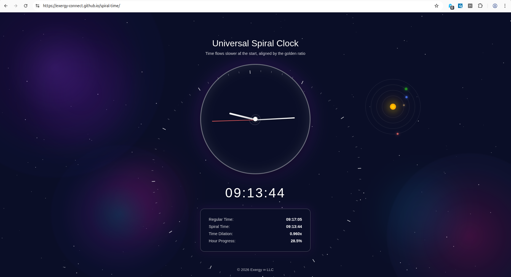

# Universal Spiral Clock

A beautiful web application that visualizes time flowing according to the golden ratio, where time slows down at the start of each hour and accelerates to align with regular time by the hour's end.

## Live Demo

🌐 **[View the live clock](https://exergy-connect.github.io/spiral-time/)**

## Screenshot



*The Universal Spiral Clock displaying spiral time with its cosmic background and golden ratio visualization.*

## Concept

The Universal Spiral Clock demonstrates a unique time dilation system where **time flows slower at the beginning of each hour and gradually accelerates**, creating a spiral pattern of temporal flow. Every hour, the clock resynchronizes with regular time, ensuring perfect alignment at the top of each hour.

### How It Works

The clock uses a **golden ratio-based time dilation function** that:

1. **Starts Slow**: At the beginning of each hour (0:00), time flows at approximately **61.8%** of normal speed (1/φ, where φ is the golden ratio ≈ 1.618)

2. **Accelerates Gradually**: As the hour progresses, time speeds up following a quadratic curve based on the golden ratio

3. **Aligns at Hour End**: By the end of each hour (59:59), time flows at **100%** normal speed, ensuring perfect synchronization

4. **Resets Each Hour**: The cycle repeats every hour, creating a continuous spiral pattern

### Mathematical Foundation

The time dilation follows a quadratic function:

```
f(t) = a·t² + b·t + c
```

Where:
- `f(0) = 1/φ ≈ 0.618` (slow at start)
- `f(1) = 1.0` (normal at end)
- `∫₀¹ f(t) dt = 1` (total time equals 1 hour)

This ensures that while time flows slower at the beginning, the accumulated time over the hour equals exactly one regular hour, maintaining synchronization.

## Features

- **Real-time Visualization**: Smooth, animated clock hands showing spiral time
- **Dual Time Display**: Shows both regular time and spiral time side-by-side
- **Time Dilation Indicator**: Displays the current time dilation factor
- **Spiral Tick Marks**: 60 tick marks around the clock face representing spiral seconds, synchronized at the top every 60 regular seconds
- **Cosmic Background**: Animated space background with galaxies, nebulas, and a solar system
- **Golden Ratio Spiral**: Visual spiral overlay that expands and contracts with the hour's progress

## Usage

Simply open `index.html` in a modern web browser. The clock will automatically start displaying spiral time.

### Understanding the Display

- **Main Clock**: Shows spiral time with hour, minute, and second hands
- **Regular Time**: Standard clock time (24-hour format)
- **Spiral Time**: Time according to the golden ratio dilation
- **Time Dilation**: Current speed multiplier (starts at ~0.618x, reaches 1.0x by hour end)
- **Hour Progress**: Percentage through the current hour (0-100%)

## Technical Details

### Time Calculation

The spiral time is calculated using a closed-form integral of the quadratic dilation function:

```
Spiral Time = ∫₀ᵗ f(u) du = a·t³/3 + b·t²/2 + c·t
```

This ensures smooth, continuous time progression without numerical integration overhead.

### Synchronization

Every 60 regular seconds, the spiral tick marks align at the top of the clock (12 o'clock position), ensuring visual synchronization between spiral and regular time at minute boundaries.

## Visual Design

The clock features:
- **Glassmorphism**: Frosted glass effect on the clock face and info panel
- **Space Theme**: Animated galaxies, nebulas, and planetary orbits
- **Smooth Animations**: 60fps updates for fluid hand movement
- **Responsive Layout**: Centered design that works on various screen sizes

## Browser Compatibility

Works best in modern browsers that support:
- CSS `backdrop-filter`
- CSS `transform` and `transform-origin`
- JavaScript ES6+
- `requestAnimationFrame` API

## License

© 2026 Exergy ∞ LLC

## Acknowledgments

Inspired by the mathematical beauty of the golden ratio and its appearance in natural spirals throughout the universe.
